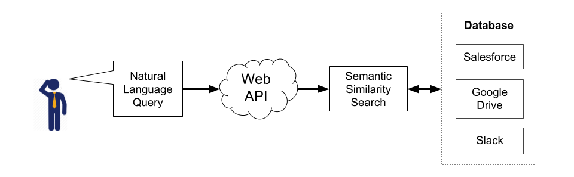
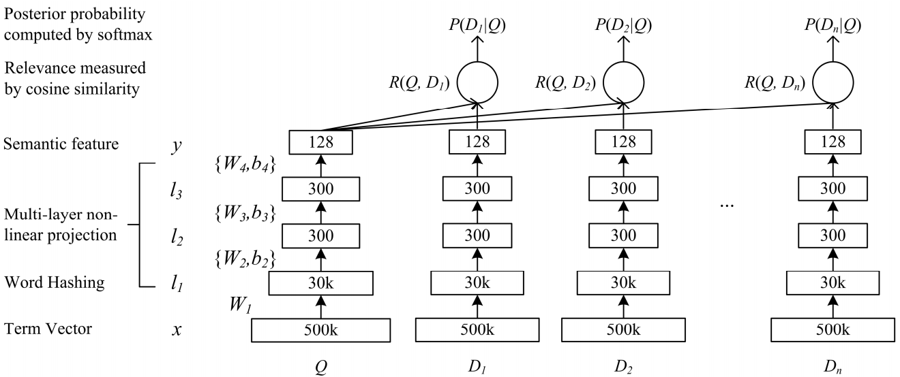

[SLIDES](https://drive.google.com/open?id=1GZxIdP2MOtHSkg2Qy3kq2UzXu_VVXDwCN1A1epawk7Y) 

[BLOG](https://jacobpolloreno.com/insight-ai-workbuddy.html)

# WorkBuddy

<p align='center'>

</p>

Workbuddy helps you get to the real work by create a search engine for company information. It leverages neural information retrieval to build embeddings, the cache and serve them through a REST API.

### How it works?

**Algorithm**:

1. Build embeddings of query and documents using DSSM model(see below).
	- Use cosine similarity with a max margin loss that distinguishes from positive/relevant answers and negative/irrelevant answers to train the model. The result of training will be a scoring function that during inference, given a query and document, output a retreival score.
2. Cache document embeddings in [NMSLIB](https://nmslib.github.io/nmslib/#)
3. Given a query, we'll compute its embeddings, using the DSSM model, then perform KNN search with NMSLIB.
4. The result with be a retrieval score for the given query-document pairs

#### Installation

```sh
git clone https://github.com/JacobPolloreno/OfficeAnswers.git
cd OfficeAnswers
```

##### Locally with virtualenv
###### **Assumes _virtualenv_ is installed. If not `pip install virtualenv`**

```sh
source venv/bin/activate
bash build/run_build.sh
```

##### AWS with _Conda env_ with TF + Keras Py36

```sh
source activate <CONDA_ENV_NAME>
bash build/aws_build.sh
```

#### Steps to Run
After you run the build script, WikiQA dataset was downloaded to ```data/raw```. 

The WikiQA dataset provides the main framework for learning question-answer pairs. It'll be augmented by your own custom dataset which you want to search. [See below to find out how to format your custom dataset.] 


##### Step 1: Configuration

Create a copy of config file
```sh
cd configs
cp sample.config custom.config
#edit custom.config
```
* Modify line 14 "custom_corpus" with the path to your custom dataset. **recommend placing the dataset in ```data/raw``` folder**
	- e.g. "custom_corpus": "./data/raw/custom_corpus.txt"

##### Step 2: Prepare and Preprocess
```sh
cd OfficeAnswers
python src/main.py configs/custom.config prepare_and_preprocess
```

##### Step 3: Train
```sh
cd OfficeAnswers
python src/cli.py configs/custom.config train
```

##### Step 4: Search
```sh
cd OfficeAnswers
python src/cli.py configs/custom.config search
```

### Model - Deep Semantic Similarity Model (DSSM)
<p align='center'>

</p>

Paper describing the model is [here](https://posenhuang.github.io/papers/cikm2013_DSSM_fullversion.pdf)

Why this model?

DSSM builds a scoring function for query and document pairs. The scoring function will allow us to **rank** candidate answers.

We'll independently learn a representation for each query and candidate documents. Then we'll calculate the similarity between the two estimated representations via a similarity function.

The DSSM model uses a siamese network(pairwise scenario) during training where we have two pointwise networks(MLP) that share parameters and we update those parameters to minimize a pairwise max margin loss.

##### Input

One query and several documents are input to the model at the same time. Only one of the documents is most related to the query labeled as a positive(1) value. The other documents are all negative(0) documents, that are not related to the query.

Queries and documents mapped on letter n-gram spaces instead of traditional word spaces.

N-grams are defined as a sequence of n letters. Typically, (as seen in the above diagram) a term vector(_X_) with 500K words can be mapped to n-gram vectors(_l1_) sized only around 30K.

##### Output

For each query and document pair we'll get a scoring function that output a score for a given pair of query and document.


#### Dataset
- [WikiQA](https://www.microsoft.com/en-us/download/details.aspx?id=52419) dataset which contains a set of question and sentence pairs.
	-  3,047 questions and 29,258 sentences in the dataset, where 1,473 sentences were labeled as answer sentences to their corresponding questions. 
- Slack Data Dump from Insight Data Science
- HR question and sentence pairs from an Insight Data Science survey

WikiQA was used to build the embeddings along with the custom data(Slack + HR).
### How should my data be formatted?
Raw data should be tab-seperated in the follow format:

_<QUESTION\>\t<ANSWER\>\n_
	
```
how are glacier caves formed ?	A partly submerged glacier cave on Perito Moreno Glacier .
how are glacier caves formed ?	The ice facade is approximately 60 m high
```
### Testing
```sh
cd OfficeAnswers
python -m pytest
```
